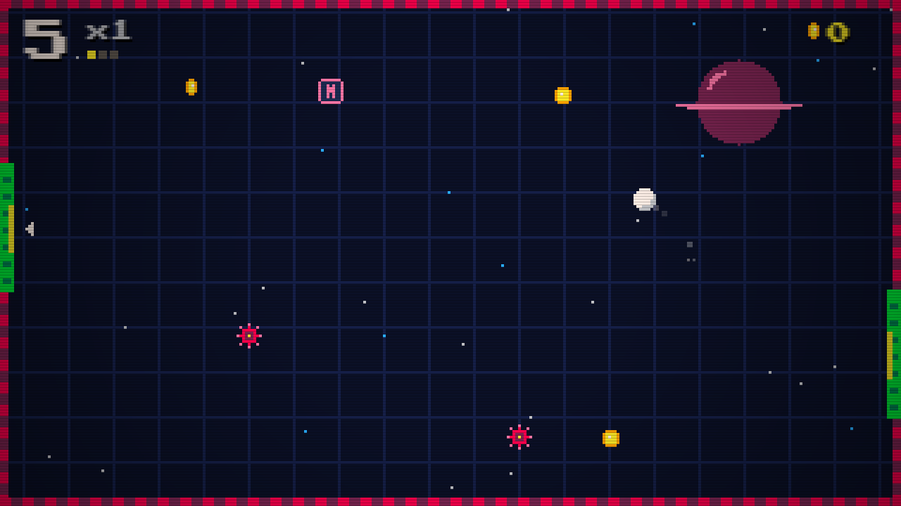
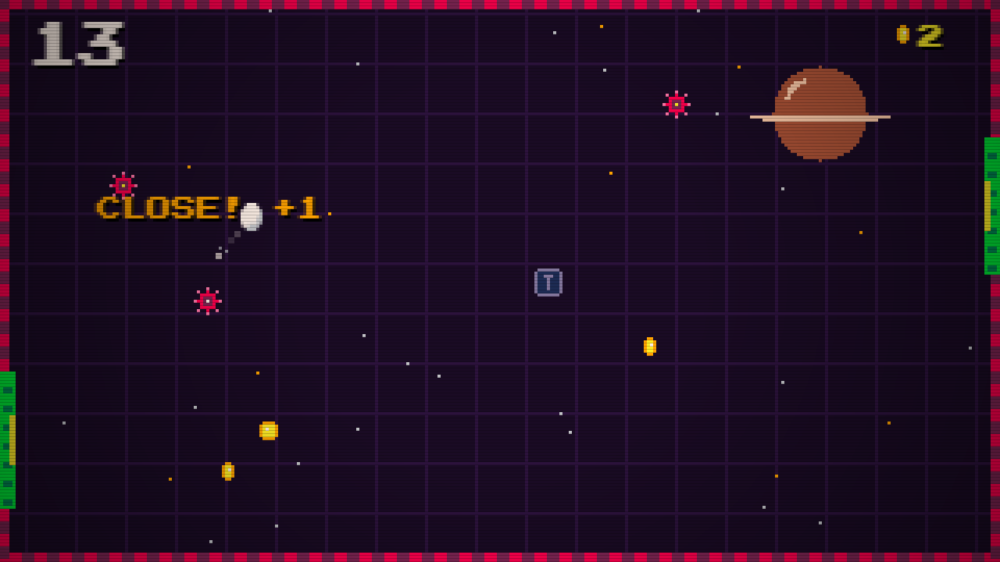
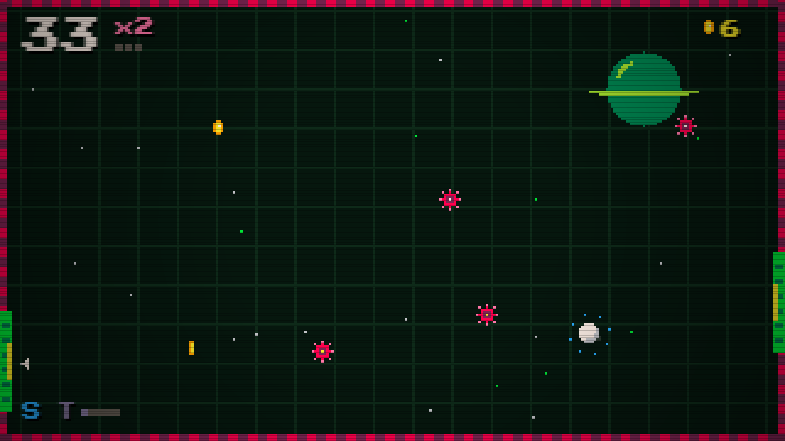

# Pong Reimagined

**A retro pixel arcade game where you are the ball.** Flap against gravity, bounce off the goals, and chase a high score.

**[▶ Play it in your browser](https://yowhann321.github.io/MyPersonalWebsite/projects/pong-reimagined/)**

| Stage 1 · Neon Night | Stage 2 · Sunset Drive | Stage 3 · Toxic Cave |
|---|---|---|
|  |  |  |

## How to play

- **Flap** with Space, a click, or a tap. Gravity does the rest.
- Hit the **green goal** on each wall to bounce back and score. The **yellow middle** of a goal is a **PERFECT** and scores double.
- **Combos:** every 3 perfects in a row raises your multiplier, up to x5.
- **Avoid** the red walls and spike mines. Mines blink before they arm, and passing one closely scores a **close call** bonus.
- **Coins** unlock 7 ball skins. **Power-ups:** S shield (survive one hit), T slow-mo, M coin magnet, 2 double points.
- Every 6 goals you reach a new **stage**: the colors change, the ball speeds up, more mines appear, and later stages add drifting mines and sliding goals. It never ends.

Controls: **Space / click / tap** to flap, **P** or **Esc** to pause, **M** to mute.

## How it's built

- Plain JavaScript and Canvas, with no libraries or build step. Everything lives in [`web/game.js`](web/game.js).
- The game renders to a real **320×180** pixel screen and scales it up at whole-number sizes so every pixel stays crisp, then adds CRT scanlines and a vignette.
- **All art is drawn in code:** the ball skins, mines, coins, and power-ups are small pixel maps in the source. Backgrounds, planets, and stars are generated.
- **All sound is synthesized** with the Web Audio API: chiptune sound effects and a four-bar soundtrack (bass, arpeggio, lead, and drums) that speeds up each stage. The game ships no image or audio files.
- Mines never spawn in the ball's path, and they flash before becoming deadly. This was checked with an automated bot over hundreds of runs.
- High score, best combo, coins, and your chosen skin are saved in the browser.

To run it locally, open `web/index.html`, or serve the `web` folder with any static server.

## Credits

Created by **Johann Lijauco**. Inspired by a game jam project from October 2023, where Johann was the team's project manager. This version is a full redesign with new art, sound, and code.

Uses the [Press Start 2P](https://fonts.google.com/specimen/Press+Start+2P) font by CodeMan38 (SIL Open Font License).
